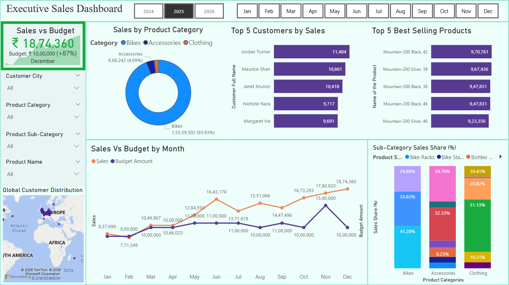

# Executive-Sales-Analytics-Dashboard-SQL-Power-BI
Designed an end-to-end sales analytics dashboard in Power BI by integrating SQL data extraction, star schema modeling, and DAX measures to deliver interactive insights into sales performance, budget tracking, customer trends, and product performance.
## Dashboard Preview

## Technologies Used

- SQL Server
- Power BI
- DAX
- Microsoft Excel
- ## Features

- Executive Sales KPI Dashboard
- Sales vs Budget Analysis
- Monthly Sales Trend Analysis
- Top 5 Customers by Sales
- Top 5 Best Selling Products
- Product Category Analysis
- Global Customer Distribution
- Interactive Slicers and Filters
