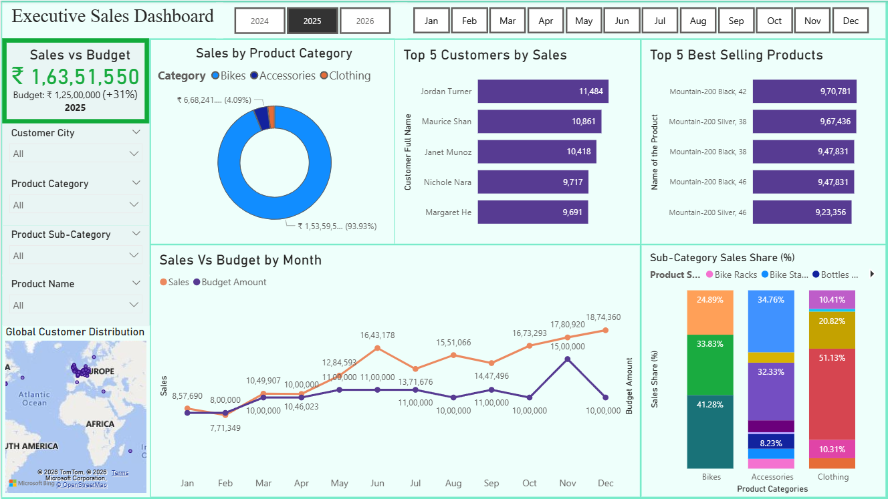

# Executive-Sales-Analytics-Dashboard-SQL-Power-BI
Designed an end-to-end sales analytics dashboard in Power BI by integrating SQL data extraction, star schema modeling, and DAX measures to deliver interactive insights into sales performance, budget tracking, customer trends, and product performance.
## Dashboard Preview


## Project Overview
This project demonstrates the development of an end-to-end Executive Sales Analytics Dashboard using SQL, Power BI, and DAX. The solution involves extracting and transforming data from the AdventureWorks database, designing a star schema data model, creating DAX measures, and building an interactive dashboard to deliver actionable business insights. Key analyses include sales performance against budget, top customers, best-selling products, product category distribution, global customer distribution, and monthly sales trends through dynamic visualizations and interactive filters.
## Work Flow
SQL Server
     →
Data Extraction
     →
CSV/Excel
     →
Power BI
     →
Data Modeling
     →
DAX Measures
     →
Dashboard
## Technologies Used

- SQL Server
- Power BI
- DAX
- Microsoft Excel
## Features

- Executive Sales KPI Dashboard
- Sales vs Budget Analysis
- Monthly Sales Trend Analysis
- Top 5 Customers by Sales
- Top 5 Best Selling Products
- Product Category Analysis
- Global Customer Distribution
- Interactive Slicers and Filters
## Data Model

- Built using a Star Schema
- Fact Table:
    - Fact_Internet_Sales

- Dimension Tables:
    - Dim_Calendar
    - Dim_Customer
    - Dim_Product

- Budget Table:
    - Sales_Budget
## Dashboard Highlights

✔ Sales vs Budget Performance

✔ Top 5 Customers

✔ Top 5 Best Selling Products

✔ Product Category Analysis

✔ Monthly Sales Trend

✔ Global Customer Distribution

✔ Interactive Filtering
## Key Insights

- Sales improved significantly from 2024 to 2025, increasing from ₹58.4 lakh to ₹1.64 crore while exceeding the annual budget by 31%.
- Bikes consistently contributed over 90% of total revenue, highlighting both a strong core product line and a reliance on a single category.
- Monthly sales showed a clear upward trend during 2025, peaking in December, indicating strong year-end performance.
- The Mountain-200 product series remained the best-selling product line across multiple years.
- Analysis of top customers revealed increased customer spending in 2025, contributing to overall revenue growth.
- Preliminary 2026 data (January only) suggests an early shift toward accessory sales, though additional months are required for meaningful trend analysis.
## Skills Demonstrated

- SQL
- Power BI
- DAX
- Data Modeling
- Star Schema
- Data Visualization
- KPI Reporting
- Business Intelligence
## Repository Structure

```text
Executive-Sales-Analytics-Dashboard-SQL-Power-BI
│
├── Data
│   ├── Dim_Calendar.csv
│   ├── Dim_Customer.csv
│   ├── Dim_Product.csv
│   ├── Fact_Internet_Sales.csv
│   └── Sales_Budget.xlsx
│
├── SQL
│   ├── Dim_Calendar.sql
│   ├── Dim_Customer.sql
│   ├── Dim_Product.sql
│   └── Fact_Internet_Sales.sql
│
├── Screenshots
│   └── Executive_Sales_Dashboard.png
│
├── Sales_Dashboard.pbix
├── README.md
└── LICENSE
```
## About the Dataset

The project uses the **AdventureWorksDW2022** sample data warehouse provided by Microsoft. SQL scripts included in this repository were used to extract and prepare the data for Power BI analysis.

## Author

**Farrukh Arshad Hussain**

GitHub: https://github.com/farshad2310

## License

This project is licensed under the MIT License. See the **LICENSE** file for details.
## Additional Documentation

➡️ Business Insights: [Executive_Sales_Insights.md](Executive_Sales_Insights.md)

This report summarizes the key business findings derived from the dashboard, including year-over-year performance, budget variance, customer trends, product analysis, and executive-level recommendations.
